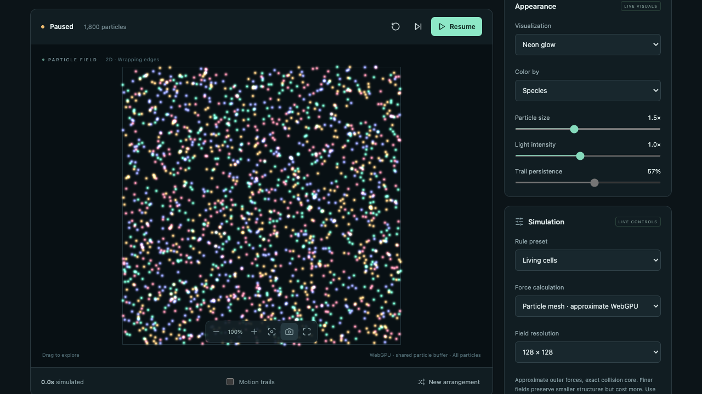

# Particle Life

Just a small toy to play with particles and enjoy emergent behaviour.

Four kinds of particles, a handful of simple attraction/repulsion rules – and suddenly things start to swarm, chase each other, form cells and fall apart again. No AI, no training, no backend: everything runs right in your browser.

**[▶ Try it live](https://stefanpuest.github.io/particleLifeResearchLab/)**



## What you can do

- Tweak how each particle type reacts to every other type (near and far forces, attract or repel)
- Pick a rule preset or just hit randomize and see what happens
- Play with particle count (up to 50,000), radius, friction and speed
- Switch between CPU and WebGPU physics
- Add trails, glow effects, zoom and pan, save screenshots
- Save and share your favourite settings as JSON

## Run it locally

Requires Node.js 22.12+.

```sh
npm ci
npm run dev
```

Then open the URL shown in the terminal.

## Build & test

```sh
npm test          # unit tests
npm run build     # production build into dist/
npm run test:e2e  # browser tests (run `npx playwright install chromium` once)
```

## Deployment

Pushing to `main` builds the app and publishes it to GitHub Pages via `.github/workflows/pages.yml`.
In the repository settings, set **Pages → Source** to **GitHub Actions** once.

## More details

Curious about the force law, the solvers (grid, BVH, Barnes–Hut, particle mesh) or the benchmarks? See [docs/technical-notes.md](docs/technical-notes.md).

Third-party licenses: [THIRD_PARTY_NOTICES.md](THIRD_PARTY_NOTICES.md)
